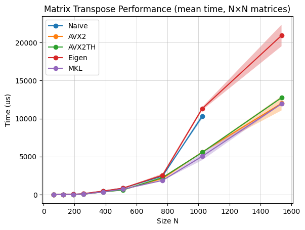
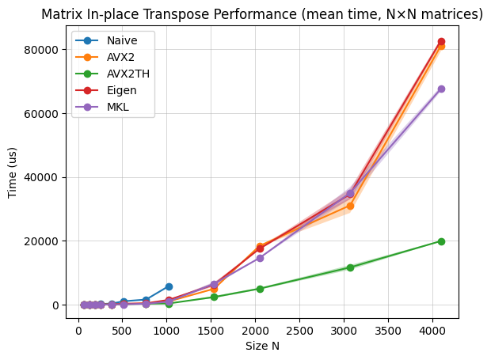
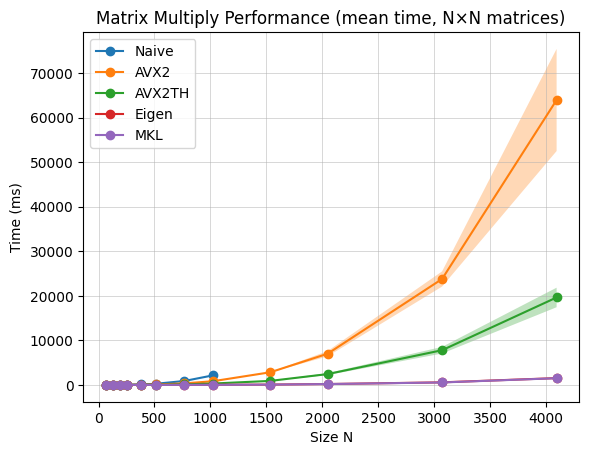
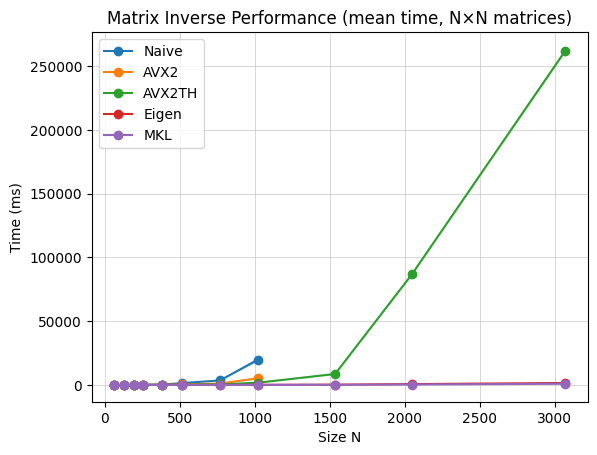

# III - Linear Algebra Benchmark
Comparison between backends using Google Benchmark across 4 operations

**Test Environment:**
- **CPU:** Intel Core i5-10300H @ 2.50GHz (4C/8T, Comet Lake)
- **RAM:** 8GB DDR4-2933
- **Compiler:** MSVC 2022 (`/O2 /arch:AVX2`)
- **OS:** Windows 11
- **Matrix sizes:** 64×64 to 4096×4096
- **Precision:** Double (FP64)

### 1) - Transpose
Matrix transpose swaps rows and columns (Aᵀ[i,j] = A[j,i]). Memory-bound, O(n²).

**Implementation details:**
- **Naive:** Copy elements to new matrix
- **AVX2 / AVX2 Threaded Blocked:** Cache-optimized block transpose 4x4 blocks using SIMD instructions to process 4 doubles simultaneously

Implementations use blocking to keep data in L1/L2 cache and leverage SIMD for parallel arithmetic.

  

Apart from Naive and Eigen, **backends show equivalent performance**. All backends saturate the available memory bandwidth (max transfer speed between RAM and CPU).

**Notes:**
- **AVX2TH** = AVX2 with multithreading
- **Naive:** Benchmark stopped at n=1024 due to excessive runtime
- **Eigen:** Severe degradation at n≥1024, likely caused by double memory copy

### 2) - In-place Transpose
Swaps rows and columns within the same matrix (no allocation). Memory-bound, O(n²).

**Implementation details:**
- **Naive:** Direct element swapping
- **AVX2 / AVX2 Threaded Blocked:** Cache-blocked algorithm processing symmetric pairs:
  - Load blocks A[i,j] and A[j,i] (transposed positions)
  - Transpose both blocks
  - Swap and write back

This symmetric approach processes two blocks simultaneously, improving cache efficiency.

  

**AVX2 Threaded dominates**. Eigen and MKL might be single threaded on in-place transpose operation. As we can see, with 4 threads, AVX2 Threaded is 4x faster, so we can make the assumption.

**Notes:**
- **AVX2TH** = AVX2 with multithreading
- **Naive:** Benchmark stopped at n=1024 due to excessive runtime

### 3) - Matrix multiplication
Computes C = A × B where all matrices are n×n. Compute-bound, O(n³).

**Implementation details:**
- **Naive:** Triple nested loop (i, j, k order)
- **AVX2 / AVX2 Threaded:** Cache-blocked algorithm with:
  - Tiled iteration over matrix blocks
  - Vectorized inner loops using AVX2 FMA instructions
  - Optimized memory access patterns to maximize cache hits

Implementations use blocking to keep data in L1/L2 cache and leverage SIMD for parallel arithmetic.

  

**MKL and Eigen dominates as expected**. AVX2 Threaded shows decent scaling with 4 threads but cannot match the highly tuned kernels of MKL/Eigen for this compute-intensive operation.

**Notes:**
- **AVX2TH** = AVX2 with multithreading
- **Naive:** Benchmark stopped at n=1024 due to excessive runtime

### 4) - Inverse
Computes A⁻¹ for an n×n matrix. Mixed (compute + memory), O(n³)

**Naive / AVX2 / AVX2 Threaded with LU decomposition approach:**
- Decompose A = LU with partial pivot
- Solve LUX = I by forward/backward substitution
- Result X = A⁻¹

LU-based inversion involves both matrix decomposition (compute-intensive) and triangular solves (memory access patterns matter).

  

**AVX2 Threaded outperformed by far by MKL and Eigen**.

**Notes:**
- **AVX2TH** = AVX2 with multithreading
- **Naive and AVX2:** Benchmark stopped at n=1024 due to excessive runtime